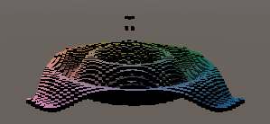
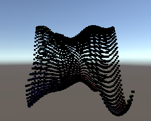
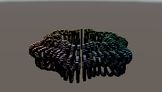

# unity-graph

A Unity Project which helps map time dependent and independent functions into 3D space.

Some of the patterns created include:

1. Ripple

2. Various Forms of Sinusoidal waves

3. Torus, Sphere etc.

Built by following:

1. https://catlikecoding.com/unity/tutorials/basics/building-a-graph/
2. https://catlikecoding.com/unity/tutorials/basics/mathematical-surfaces/
